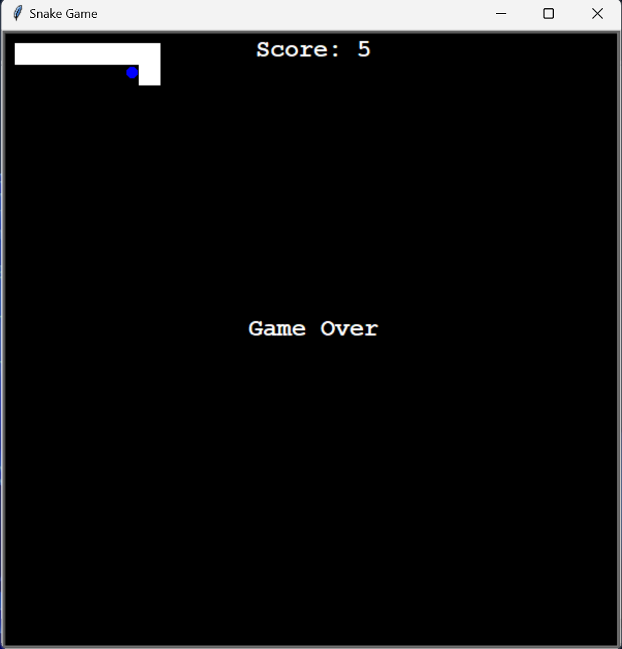

# Classic-Snake-Game

This is a simple implementation of the classic Snake Game using Python's `turtle` module.

## Game Overview

In this game, the player controls a snake which moves around the screen. The objective of the game is to eat food that randomly appears on the screen. Each time the snake eats the food, it grows longer and the game becomes more challenging. The game ends if the snake hits the wall or its own tail.

## Files

The project consists of the following Python files:

- `snake.py`: This file contains the `Snake` class which is responsible for creating the snake, moving it around the screen, and extending its length when it eats food.
- `food.py`: This file contains the `Food` class which is responsible for creating the food and randomly placing it on the screen.
- `scoreboard.py`: This file contains the `ScoreBoard` class which is responsible for keeping track of and displaying the player's score.
- `main.py`: This file contains the main game loop which uses the above classes to run the game.

## How to Run

To run the game, simply run the `main.py` file in a Python environment that has the `turtle` module installed.

## Controls

The controls for the game are as follows:

- Up Arrow: Move the snake up
- Down Arrow: Move the snake down
- Left Arrow: Move the snake left
- Right Arrow: Move the snake right

Enjoy the game!

## ScreenShot

